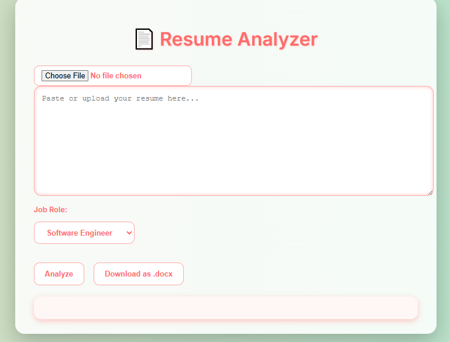
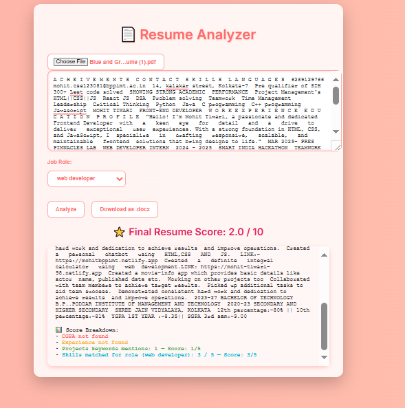

# cv-score-checker

  

# 📄 Enhanced Offline Resume Analyzer

This is a client-side (browser-based) web application designed to help users analyze their resumes against specific job roles. It provides instant feedback on keyword matching, resume length, and general structure, with the ability to upload PDF files and download an analysis report as a DOCX document.

**Crucially, this tool operates entirely offline in your browser after the initial load, ensuring your resume data remains private and is never sent to a server.**

## ✨ Features

* **Offline Operation:** Your data stays on your device.
* **PDF Resume Upload:** Directly upload your PDF resume for analysis.
* **Role-Based Keyword Matching:** Select a job role to see how well your resume matches relevant industry keywords.
* **Resume Score:** Get an immediate score out of 10 indicating your resume's overall strength.
* **Detailed Feedback:**
    * Overall assessment.
    * Keyword analysis (found vs. missing).
    * Identification of overused phrases (highlighted in the displayed resume).
    * Suggestions for grammar, clarity, and formatting improvements.
    * Checks for essential contact information.
    * Guidance on quantifying achievements and using strong action verbs.
* **Dynamic Theme Toggle:** Switch between dark and light modes for comfortable viewing.
* **Download Analysis Report:** Generate and download a `.docx` file containing your original resume text and the full analysis report.

## 🚀 How to Use (Local Setup)

This application is designed to run directly in your web browser without needing a server.

  

1.  **Download/Clone the Repository:**
    * If you have the files (e.g., `index.html`, `style.css`, `script.js`), ensure they are all in the same folder.
    * If this were a Git repository, you would clone it: `git clone <repository_url>`

2.  **Open `index.html`:**
    * Navigate to the folder where you saved the files.
    * Double-click the `index.html` file. It will open automatically in your default web browser.

## 💻 Technologies Used

[!CSS3]
     !
** A JavaScript library by Mozilla for parsing and rendering PDF files directly in the browser.
* [docx](https://docx.js.org/#/):** A JavaScript library for generating `.docx` files.
* [Font Awesome](https://fontawesome.com/):** For various icons used throughout the UI.
